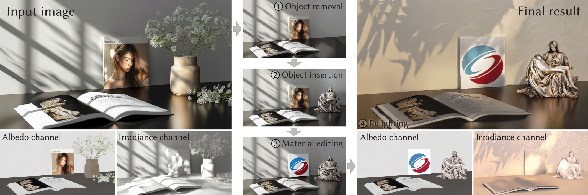

<h1 align="center"> IntrinsicEdit: Precise generative image<br/>manipulation in intrinsic space</h1>

<p align="center">ACM Transactions on Graphics (Proceedings of SIGGRAPH), 2025</p>

<p align="center"><a href="https://intrinsic-edit.github.io">https://intrinsic-edit.github.io</a> </p>

<p align="center"></p>

We propose a generative framework for diverse image-editing tasks, where precise manipulations can be performed in an intrinsic-image space and global-illumination effects are subsequently resolved automatically. Here we show a progressive transformation of an input image: ➀ We first remove the flowers and the vase from the albedo channel and then ➁ insert a new object in that channel. ➂ We replace the texture of another object before ➃ relighting the scene using a new irradiance channel. After each intrinsic-channel manipulation, we can render a physically plausible result. No single prior method can
perform all these edits and provide similar levels of precision and identity preservation while delivering comparable image quality.

# Abstract

Generative diffusion models have advanced image editing with high-quality results and intuitive interfaces such as prompts and semantic drawing. However, these interfaces lack precise control, and the associated methods typically specialize on a single editing task. We introduce a versatile, generative workflow that operates in an intrinsic-image latent space, enabling semantic, local manipulation with pixel precision for a range of editing operations. Building atop the RGB-X diffusion framework, we address key challenges of identity preservation and intrinsic-channel entanglement. By incorporating exact diffusion inversion and disentangled channel manipulation, we enable precise, efficient editing with automatic resolution of global illumination effects -- all without additional data collection or model fine-tuning. We demonstrate state-of-the-art performance across a variety of tasks on complex images, including color and texture adjustments, object insertion and removal, global relighting, and their combinations.

# Runing the demo

This is the official PyTorch implementation of IntrinsicEdit, in the form of a Gradio web demo. Getting the demo running on a Linux machine with CUDA is easy. Create a conda environment and launch the script as follows:

```
conda env create -f environment.yml -y
conda activate intrinsicedit
python demo.py
```

The demo uses the pretrained [RGB↔X models](https://github.com/zheng95z/rgbx) of [Zeng et al. \[2024\]](https://zheng95z.github.io/publications/rgbx24), which are download automatically to your HuggingFace cache folder during inference.

# Workflow

1. Take an image you want to edit.
2. Use `rgb2x` from [RGB↔X](https://github.com/zheng95z/rgbx) to decompose the image into intrinsic channels, e.g., albedo, normal, irradiance. Try different seeds (in the advanced options) for potentially better decompositions.
3. Edit one or more channels, e.g., modify the albedo channel for object removal or appearance editing.
4. Run the demo by providing the input image, along with the original and edited channel, to obtain edited results.

## Example: Albedo-based editing
This example demonstrates object removal or appearance editing by modifying the albedo channel. Note that the irradiance channel is required by default.

Input:
- Original image
- Original irradiance (used for prompt optimization)
- Original albedo
- New (edited) albedo

For more examples, please refer to the [results folder](https://github.com/LinjieLyu/IntrisinEdit/tree/main/images/results).

# Note
- If you want to edit other intrinsic channels (e.g. normal, roughness, irradiance), you must provide the original and new versions of that channel as a pair:

- For channels that are not being edited, you have two options:

1. Leave them blank — we will automatically fill in the missing channels for you.

2. Provide the same image as both the original and new version to indicate no changes.


